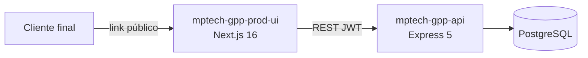

# Arquitetura do Sistema GPP

O **GPP (Gestão de Pedidos e Produtos)** é um sistema SaaS multi-tenant para negócios de personalização (brindes, festas, empresas). A marca na UI é **Zentra**.

## Visão geral



## Camadas da API

```
Request → Route → [authMiddleware + permissionMiddleware] → Controller → Service → Prisma → PostgreSQL
```

## Camadas da UI

```
Page (App Router) → hooks/providers → api.ts (ApiClient) → API REST
```

## Padrão de resposta da API

```json
{ "success": true, "data": {...}, "meta": { "page", "limit", "total" } }
{ "success": false, "error": { "message", "code", "details?" } }
```

## Jobs em background

Iniciados em `server.ts`, executam a cada **60 segundos**:

1. `processarLembretesPendentes()` — notifica lembretes vencidos
2. `processarAlertasPrazoPedidos()` — alertas de prazo de entrega

## Relacionado

- [[multi-tenancy]]
- [[autenticacao-jwt]]
- [[rbac]]
- [[stack-tecnico]]
- [[features/autenticacao]]
