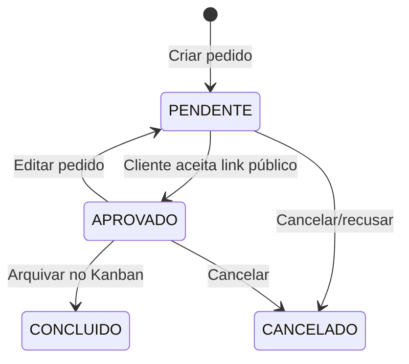

# Ciclo de Vida do Pedido

Fluxo central do sistema GPP, da criação à conclusão.

## Estados

| Status | Descrição |
|--------|-----------|
| `PENDENTE` | Pedido criado, aguardando aprovação do cliente |
| `APROVADO` | Cliente aprovou; entra no Kanban de produção |
| `CONCLUIDO` | Produção finalizada (arquivado) |
| `CANCELADO` | Pedido cancelado/recusado |

## Fluxo típico

## Regras de negócio

1. Numeração automática: `PED-0001`, `PED-0002`... por tenant
2. Valor total = soma itens + extras
3. Edição permitida apenas em `PENDENTE` ou `APROVADO`
4. Editar pedido `APROVADO` → volta para `PENDENTE` e limpa `kanbanColunaId`
5. Enviar ao cliente (`POST /enviar`) → `enviadoCliente: true` + gera `linkToken` UUID
6. Sair de `APROVADO` → limpa `linkToken`
7. DELETE = soft cancel (`status → CANCELADO`)
8. Só produtos `ATIVO` entram em pedidos
9. Cliente deve estar ativo

## Integração Kanban

- Apenas pedidos `APROVADO` aparecem no board
- Arquivar na coluna "Finalizado" → `CONCLUIDO`

## Relacionado

- [[pedido]]
- [[features/pedidos]]
- [[features/kanban]]
- [[features/portal-publico]]
- [[alertas-prazo]]
